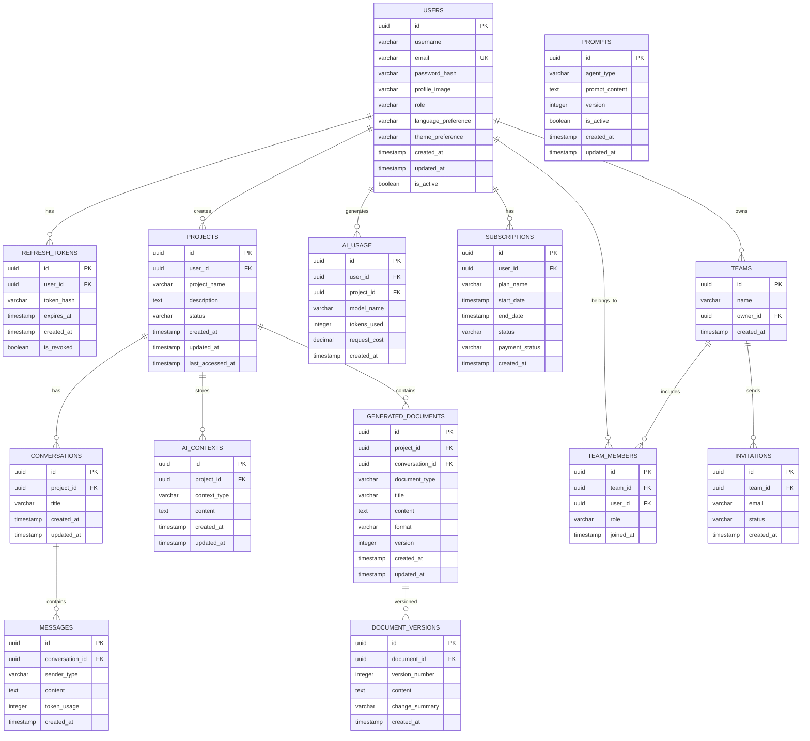

# ArchPilot - Database Design

## Database: PostgreSQL

## Entity Relationship Diagram

## Table Definitions

### Users
- PK: `id` (UUID)
- Unique: `email`
- Index: `email` (for login lookup)
- Index: `username`

### RefreshTokens
- PK: `id` (UUID)
- FK: `user_id` → Users
- Index: `token_hash` (for token lookup)
- Index: `user_id` + `is_revoked` (for active token check)

### Projects
- PK: `id` (UUID)
- FK: `user_id` → Users
- Index: `user_id` (for user's projects)
- Index: `last_accessed_at` (for recent projects)

### Conversations
- PK: `id` (UUID)
- FK: `project_id` → Projects
- Index: `project_id`

### Messages
- PK: `id` (UUID)
- FK: `conversation_id` → Conversations
- Index: `conversation_id` + `created_at`

### AIContexts
- PK: `id` (UUID)
- FK: `project_id` → Projects
- Index: `project_id` + `context_type`

### GeneratedDocuments
- PK: `id` (UUID)
- FK: `project_id` → Projects
- FK: `conversation_id` → Conversations (nullable)
- Index: `project_id` + `document_type`

### DocumentVersions
- PK: `id` (UUID)
- FK: `document_id` → GeneratedDocuments
- Index: `document_id` + `version_number`

### Prompts
- PK: `id` (UUID)
- Unique: `agent_type` (only one active prompt per agent)
- Index: `agent_type` + `is_active`

### AIUsage
- PK: `id` (UUID)
- FK: `user_id` → Users
- FK: `project_id` → Projects
- Index: `user_id` + `created_at` (for billing queries)

### Subscriptions
- PK: `id` (UUID)
- FK: `user_id` → Users
- Index: `user_id` + `status`

### Teams / TeamMembers / Invitations
- For future team collaboration features
